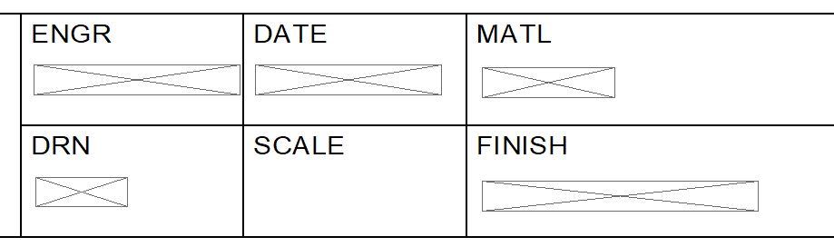

# Convert Draft to 2D

Sample program illustrating the use of PowerShell for the Solid Edge Housekeeper `Run External Program` task.  

The program converts drawing views to stand-alone 2D views, disconnected from the 3D model. This is irreversible, so you know, think about it. 

In testing it quickly became apparent that this operation also converts Property text to blank lines in Callouts. 

Luckily, Solid Edge has the ability to take care of that. That's in the program, too, but only for Callouts. If you have TextBoxes, Blocks, or other objects that use Property text, you'll have to add code to deal with those. 

Speaking of code, the sample uses PowerShell, but just barely. It is really only a thin wrapper on a Visual Basic script. If you have a better example, I would be glad to host it here. Naturally I would credit you as the contributor. That's not worth any money, but it does up your 'cred' on GitHub.