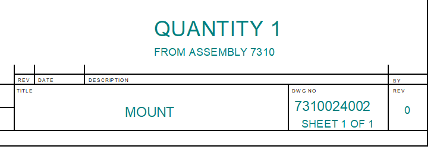

# QtyFromAssy

Gets the total quantity of each part and 
subassembly in a given assembly
and adds that information to the 
part (or subassembly) file. 
In addition to the quantity,
the program also records the assembly name 
from which the quantity was derived.
Both are added as custom properties, 
making them available, for example, in a 
Callout in Draft. 

  

The program checks the `IncludeInBOM` flag and 
does not process files set to `NO`.  It also 
checks `User-Definied Quantity` and 
proceeds accordingly.

You can specify the custom property names. 
They are stored in `program_settings.txt` 
in the program's root directory. 

The settings file has two other variables, 
`QuantityMultiplier` and `IncludeWeldmentParts`.

`QuantityMultiplier`, as you might guess, multiplies the 
part (or subassembly) quantity by this value.
It is for the case when you need to make 
multiples of the given assembly.

`IncludeWeldmentParts` is a flag for 
subassemblies marked `Weldment` in Solid Edge.
Normally in reports, such assemblies are counted, 
but not the parts they contain. 
This is your chance to change that. 

The program can be run from Solid Edge Housekeeper 
or stand-alone.  In stand-alone mode, the 
assembly file must be open in Solid Edge before 
starting the command.  

Running from Housekeeper,
note that you should, in most cases, 
only process the top-level assembly. 
If you run this external program on multiple
assemblies, the quantity and source information
will be overwritten on parts they have in common.